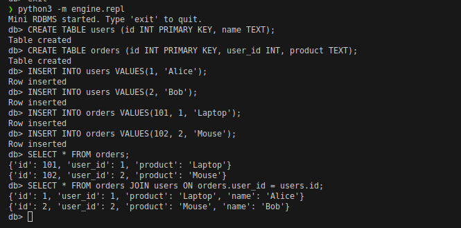

# Mini RDBMS (Pesapal JDEV26 Challenge)

This project is a **simple in-memory relational database management system (RDBMS)** implemented from scratch in Python. It is designed to demonstrate core database concepts—such as SQL parsing, query execution plans, and index-based optimization—without relying on external database libraries.

> **Note**: This system is for educational and demonstration purposes only. It is not intended for production use.

---

## 🚀 Features

### Core Capabilities
- **In-Memory Storage**: Fast, volatile storage (data is reset when the application exits).
- **SQL-like Interface**: Supports a defined subset of SQL grammar.
- **Interactive REPL**: A command-line Read-Eval-Print Loop for direct interaction.
- **Query Optimization**: Automatically uses Hash Joins or Index Lookups when applicable.

### Supported SQL Syntax

#### 1. Data Definition (DDL)
Create tables with typed columns, Primary Keys, and Unique constraints.
```sql
CREATE TABLE users (
    id INT PRIMARY KEY,
    email TEXT UNIQUE,
    name TEXT
);
```

#### 2. Data Manipulation (DML)
Insert rows with validation against schema constraints.
```sql
INSERT INTO users VALUES (1, 'alice@example.com', 'Alice');
```

#### 3. Querying
Select all rows, filter by equality, or join tables.
```sql
-- Select all
SELECT * FROM users;

-- Filter (Index optimized if querying by PK/Unique)
SELECT * FROM users WHERE id = 1;

-- Inner Join (Index optimized if joining on indexed column)
SELECT * FROM orders JOIN users ON orders.user_id = users.id;
```

---

## 🛠️ Architecture

The system is modularized into several key components within the `engine/` directory:

| Component | File | Responsibility |
|-----------|------|----------------|
| **REPL** | `repl.py` | Handles user input and displays output. |
| **Parser** | `parser.py` | Regex-based parser converting SQL strings into internal command objects. |
| **Executor** | `executor.py` | Interprets commands and orchestrates data operations. |
| **Database** | `database.py` | Manages the collection of tables. |
| **Table** | `table.py` | Stores rows and manages indexes (Hash Maps). |

### Indexing Strategy
The database automatically creates hash indexes (Python dictionaries) for:
- `PRIMARY KEY` columns
- Columns marked as `UNIQUE`

**Performance Impact**:
- **O(1)** for point lookups (`WHERE id = 1`).
- **O(N)** for joins using an index (Hash Join).
- **O(N*M)** for non-indexed joins (Nested Loop Join).

---

## 📦 Getting Started

### Prerequisites
- Python 3.6 or higher.

### Running the Database
navigate to the project root directory and execute the REPL module:

```bash
# Start the interactive shell
python3 -m engine.repl
```

### Sample Session

```text
Mini RDBMS started. Type 'exit' to quit.
db> CREATE TABLE products (id INT PRIMARY KEY, name TEXT);
Table created
db> INSERT INTO products VALUES (100, 'Mechanical Keyboard');
Row inserted
db> INSERT INTO products VALUES (101, 'Gaming Mouse');
Row inserted
db> SELECT * FROM products WHERE id = 100;
{'id': 100, 'name': 'Mechanical Keyboard'}
db> exit
```

---

## 📂 Project Structure

```
pesapal-rdbms/
├── engine/             # Core database implementation
│   ├── database.py
│   ├── executor.py
│   ├── parser.py
│   ├── repl.py
│   ├── table.py
│   ├── tokenizer.py
│   └── ...             # Internal tests/scripts
├── web/                # Placeholder for web interface
└── README.md           # This documentation
```
